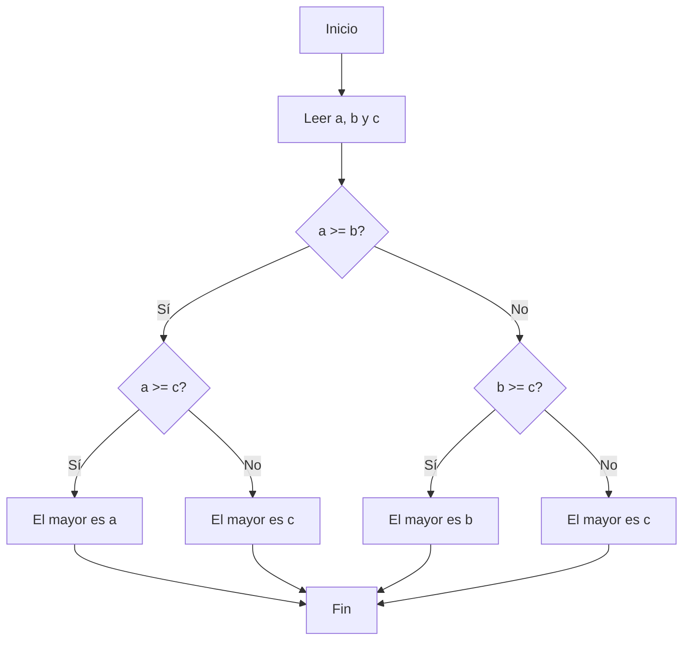

# Condicionales en Python – Notas de Clase

## ¿Qué son los condicionales en programación?

En programación estructurada existen tres tipos básicos de estructuras de control: **secuenciales**, **condicionales** e **iterativas**. Las estructuras *condicionales* (también llamadas de *selección* o *de decisión*) permiten que un programa tome **decisiones** y ejecute acciones diferentes según ciertas condiciones lógicas. En términos sencillos, un condicional le dice al programa: "*si se cumple cierta condición, realiza una acción; de lo contrario, haz algo distinto o no hagas nada*". Esto es similar a la vida diaria, donde constantemente tomamos decisiones entre opciones (por ejemplo, decidir *entre un camino u otro* o *qué ropa ponerse*). Las estructuras condicionales brindan flexibilidad al código, permitiendo combinarse con las instrucciones secuenciales para resolver problemas más complejos que requieren evaluar situaciones variables.

### Lógica booleana básica: condiciones verdaderas o falsas

Los condicionales se basan en **expresiones booleanas**, es decir, expresiones lógicas que pueden ser **verdaderas** (`True`) o **falsas** (`False`). Un ejemplo de expresión booleana es `x > 0`, que será `True` si el valor de `x` es mayor que 0 o `False` en caso contrario. En Python, el tipo booleano (`bool`) tiene justamente dos valores posibles: `True` y `False`. Estas expresiones usualmente involucran **operadores relacionales** (de comparación) y pueden combinarse con **operadores lógicos** para formar condiciones más complejas.

Algunos **operadores relacionales** comunes en Python son:

* `==` – Igualdad (verdadero si ambos operandos son iguales)
* `!=` – Desigualdad (verdadero si los operandos son distintos)
* `<` – Menor que
* `>` – Mayor que
* `<=` – Menor o igual que
* `>=` – Mayor o igual que

Por ejemplo, la expresión `5 != 3` evalúa a `True` porque 5 *no es igual* a 3, mientras que `4 <= 2` evalúa a `False` porque 4 *no es menor ni igual* a 2. Es importante **no confundir** el operador doble igual `==` (comparación) con el signo igual simple `=` (asignación de valor). Usar `=` dentro de una condición es un error de sintaxis en Python; siempre se debe usar `==` para comparar valores.

Los **operadores lógicos** principales en Python son `and`, `or` y `not`. Su significado es similar al del lenguaje natural o matemático:

* `and` (y lógico) resulta `True` solo si **ambas** condiciones son verdaderas. Por ejemplo, `x > 0 and x < 10` será verdadero únicamente cuando *x* sea mayor que 0 **y** menor que 10 simultáneamente.
* `or` (o lógico) resulta `True` si **al menos una** de las condiciones es verdadera. Por ejemplo, `n % 2 == 0 or n % 3 == 0` es verdadero si *n* es divisible por 2 **o** por 3 (cumpla una condición, la otra, o ambas).
* `not` (negación lógica) invierte el valor de verdad de una expresión booleana. Si una condición es `True`, `not` la convierte en `False`, y viceversa. Por ejemplo, `not (x > y)` será `True` solo cuando *x > y* sea falso (es decir, cuando *x* sea menor o igual que *y*).

**Nota:** En Python, a diferencia de algunos otros lenguajes, no es obligatorio encerrar la condición entre paréntesis. Se puede escribir `if x > 0:` directamente, aunque opcionalmente puedes usar paréntesis para agrupar condiciones complejas o mejorar la legibilidad. Por ejemplo: `if (x > 0 and y > 0):` es válido pero los paréntesis no son estrictamente necesarios.

## Estructuras condicionales en Python

Python utiliza la palabra clave `if` (que significa "si" en inglés) para implementar condicionales. Existen varias formas de estructuras condicionales en Python: la **sentencia `if` simple**, la sentencia **`if` con `else`**, las estructuras con múltiples condiciones usando **`elif`** (else-if encadenados), las **condicionales anidadas** (una dentro de otra) y una sintaxis especial para condicionales en una sola línea conocida como **operador ternario**. A continuación, revisaremos cada una de ellas en detalle, con su sintaxis, reglas de indentación y ejemplos en código.

### La sentencia `if` (condicional simple)

La forma más básica de condicional es la sentencia **`if`** simple. Esta estructura evalúa una condición booleana y, si la condición es verdadera (`True`), ejecuta un bloque de código asociado. Si la condición es falsa (`False`), el bloque de código *se omite* y el programa continúa con las instrucciones siguientes al `if`. En pseudocódigo se puede pensar: *"Si se cumple esta condición, ejecuta estas acciones; si no, no hagas nada diferente"*.

La sintaxis de una sentencia `if` en Python es:

```python
if <condición_booleana>:
    <bloque de código indentado>
```

**Detalles de sintaxis:** La línea del `if` termina con dos puntos `:` para indicar el inicio de un **bloque** de código. El cuerpo o bloque del `if` va en la(s) línea(s) siguiente(s), con una **indentación** (sangría) hacia la derecha. Por convención se usan 4 espacios (o una tabulación) para indentar en Python. Todas las instrucciones indentadas a este nivel formarán parte del bloque del `if`. Si la condición resulta verdadera, Python ejecutará las instrucciones indentadas; si resulta falsa, Python **saltará** ese bloque y no ejecutará esas instrucciones.


*Figura: Diagrama de flujo de una sentencia `if` simple. Si la condición es verdadera, se ejecuta la acción; si es falsa, se omite y el flujo del programa continúa después del `if`.*

A continuación, un ejemplo de código con un `if` simple en Python:

```python
# Ejemplo de if simple:
numero = int(input("Ingrese un número entero: "))
if numero < 0:
    print("El número es negativo.")
```

**Explicación:** En este programa se lee un número entero desde el teclado y luego la sentencia `if` comprueba la condición `numero < 0`. – Si la condición es verdadera (es decir, el número ingresado es menor que cero), entonces se ejecuta la línea indentada que imprime `"El número es negativo."`. – Si la condición es falsa (el número no es menor que cero, es decir, es cero o positivo), el bloque indentado se ignora completamente y no se muestra ningún mensaje. Observa que siempre se realiza la lectura del número por teclado, pero el mensaje solo aparece cuando la condición se cumple.

> **Nota:** Si se necesita un bloque vacío (sin ninguna instrucción) dentro de un `if` –por ejemplo, cuando estás esbozando código sin implementarlo aún– Python ofrece la instrucción especial `pass`. Esta instrucción no hace nada, pero sirve como *placeholder* para tener un bloque sintácticamente válido. Por ejemplo:
>
> ```python
> if numero < 0:
>     pass  # TODO: manejar números negativos en el futuro
> ```
>
> En este caso, si `numero < 0`, no ocurrirá nada debido al `pass`, pero el código es válido y no genera error.

### La sentencia `if...else` (condicional compuesto)

La sentencia `if` por sí sola solo contempla una acción cuando la condición es verdadera, sin nada que ejecutar en caso contrario. Sin embargo, muchas situaciones requieren manejar **dos alternativas**: una acción si la condición se cumple y otra acción diferente si la condición *no* se cumple. Para esto se utiliza la cláusula **`else`**, que se añade al final de un `if`. La estructura `if...else` se conoce también como condicional *compuesto* o *alternativo*, porque define dos ramas posibles de ejecución.

La sintaxis en Python es:

```python
if <condición_booleana>:
    <bloque si la condición es True>
else:
    <bloque si la condición es False>
```

Funciona así: primero se evalúa la condición del `if`. – Si es verdadera, se ejecuta el bloque indentado bajo el `if` y luego el programa salta todo el bloque del `else`. – Si la condición es falsa, **no** se ejecuta el bloque del `if`, sino que se salta directamente a ejecutar el bloque indentado bajo `else`. En cualquier caso, tras ejecutar el bloque correspondiente (ya sea el del `if` o el del `else`), el programa continúa con la siguiente instrucción después de esta estructura condicional.


*Figura: Diagrama de flujo de una estructura `if…else`. Solo una de las dos ramas (verdadera o falsa) se ejecuta, dependiendo del resultado de la condición.*

Veamos un ejemplo práctico usando `if...else`. El siguiente programa determina si un número entero es par o impar:

```python
num = int(input("Ingrese un número entero: "))
if num % 2 == 0:
    print("El número es par.")
else:
    print("El número es impar.")
```

En este caso, la condición del `if` verifica `num % 2 == 0` (es decir, "*¿el número es divisible por 2?*"). – Si la condición es verdadera, significa que el número es par y se ejecuta el bloque bajo el `if` imprimiendo `"El número es par."`. – Si la condición es falsa (el resto no es 0), entonces el número es impar y se ejecuta el bloque bajo `else`, imprimiendo `"El número es impar."`. Solo una de las dos ramas se ejecutará en tiempo de ejecución. En resumen, usamos `if...else` cuando tenemos dos caminos mutuamente excluyentes y queremos definir una acción para cada caso (por ejemplo "*si condición entonces A, si no entonces B*").

### La sentencia `if...elif...else` (condicionales encadenados o múltiples)

En muchos problemas existen **más de dos posibilidades** a considerar. En Python podemos manejar múltiples condiciones utilizando la cláusula **`elif`** (contracción de *else if*). Un condicional encadenado consta de un `if` inicial, seguido por **cero o más** bloques `elif` intermedios para condiciones adicionales, y opcionalmente un `else` final. Esta estructura permite evaluar varias condiciones en secuencia, seleccionando la primera que resulte verdadera.

La sintaxis general es:

```python
if <condición1>:
    <bloque1>
elif <condición2>:
    <bloque2>
elif <condición3>:
    <bloque3>
...
else:
    <bloque_en_caso_contrario>
```

El flujo de ejecución de un condicional múltiple es el siguiente: Python evalúa la condición del `if`. – Si es verdadera, ejecuta su bloque y **omite** todos los demás `elif` y el `else` (sale de la estructura condicional). – Si es falsa, pasa a evaluar la siguiente condición `elif`. Si esa es verdadera, ejecuta ese bloque y omite el resto. – Continua así sucesivamente con cada `elif`. – Si ninguna de las condiciones de `if` ni de los `elif` resulta verdadera, entonces (y solo entonces) se ejecuta el bloque final del `else`. En esta estructura, **solamente un bloque de código se ejecutará como máximo**, correspondiente a la primera condición verdadera que se encuentre (si ninguna es verdadera, se ejecuta el bloque `else`, y si hay un `else` implícito ausente, simplemente no se ejecuta nada).

Al usar condicionales encadenados, ten en cuenta que la cláusula `else` final es opcional; puedes omitirla si no necesitas hacer nada cuando ninguna condición se cumple. Por otro lado, puedes incluir tantos `elif` como necesites (incluso ninguno, teniendo solo `if` y `else`).


*Figura: Diagrama de flujo de una estructura `if…else…if`.*

**Ejemplo:** Supongamos que queremos comparar dos números *x* e *y* e imprimir cuál es mayor, o si son iguales. Podemos hacerlo con un `if` encadenado así:

```python
x = float(input("Ingrese el primer número: "))
y = float(input("Ingrese el segundo número: "))

if x < y:
    print("x es menor que y")
elif x > y:
    print("x es mayor que y")
else:
    print("x y y son iguales")
```

Aquí tenemos tres caminos posibles: (1) si `x < y` imprimimos "*x es menor que y*"; (2) si la primera condición es falsa pero `x > y` es verdadera, imprimimos "*x es mayor que y*"; (3) si ninguna de las dos anteriores se cumplió (lo que implica que `x < y` es falso y `x > y` también es falso, ergo *x* e *y* deben ser iguales), entonces el `else` maneja ese caso imprimiendo "*x y y son iguales*". Solo uno de los `print` se ejecutará según los valores ingresados. Nótese que estas condiciones son **mutuamente excluyentes**: una vez que una se cumple, las restantes ya no se evalúan, lo cual puede hacer el código más eficiente que usar múltiples `if` separados. Además, usar `elif` en lugar de varios `if` independientes garantiza que solo una rama corra incluso si más de una condición fuera lógicamente verdadera (lo cual puede evitar resultados inesperados).

Si agregáramos más condiciones, seguiríamos la misma estructura. Por ejemplo, podríamos extender el caso anterior para agregar un mensaje especial si *x* y *y* difieren por menos de 1 unidad, usando un `elif` adicional con esa comprobación. **No hay límite** en el número de cláusulas `elif` que se pueden encadenar, aunque en la práctica conviene no abusar de ellas por legibilidad.

### Condicionales anidados (if dentro de otro if)

Es posible colocar estructuras condicionales **dentro** de otras, creando lo que se conoce como condicionales *anidados*. Esto significa que en lugar de una instrucción simple, alguna de las ramas de un `if/else` puede contener a su vez otro `if` completo en su interior. Los condicionales anidados permiten manejar situaciones en las que se necesita tomar una decisión **dentro** de otra decisión. Sin embargo, anidar demasiados niveles de `if` puede tornar el código difícil de leer si no se diseña con cuidado.

La sintaxis de un condicional anidado simplemente aprovecha la indentación: cualquier `if` escrito dentro del bloque indentado de otro estará anidado dentro de él. Por ejemplo, consideremos nuevamente el problema de comparar dos números *x* e *y*, pero esta vez estructuraremos el código de forma anidada:

```python
if x == y:
    print("x y y son iguales")
else:
    if x < y:
        print("x es menor que y")
    else:
        print("x es mayor que y")
```

Este código logra el mismo resultado que el ejemplo con `elif` anterior: imprime una de tres posibilidades dependiendo de la relación entre *x* e *y*. Aquí el segundo `if` está **anidado** dentro de la rama `else` del primero. La lógica funciona así: si *x* e *y* son iguales, se ejecuta directamente el primer `print` y se omite todo lo demás. Si no son iguales, entonces el bloque `else` entra en acción, el cual a su vez contiene otro `if` que decide cuál de los dos números es mayor. Observa cómo la indentación aumenta con cada nivel de anidamiento, indicando claramente qué `if` pertenece a cuál bloque.

Los condicionales anidados pueden extenderse a varios niveles (un `if` dentro de otro dentro de otro, y así sucesivamente). En principio no hay un límite estricto en la profundidad de anidamiento. No obstante, **múltiples niveles de anidación pueden dificultar la legibilidad y el mantenimiento del código**. Como regla general de buena práctica, se recomienda evitar anidar demasiados `if` cuando sea posible. A menudo, problemas que inicialmente se plantean con varios niveles de `if` pueden resolverse de forma más clara combinando condiciones lógicas con `and`/`or` o utilizando estructuras `elif` encadenadas adecuadamente. Por ejemplo, el código anidado anterior podría simplificarse usando un solo `if` con un operador lógico `and`: `if x != y and x < y: ...` (aunque en este caso es quizás más claro simplemente usar `elif`). En resumen, utiliza anidamiento solo cuando realmente aporte claridad o sea necesario, y prefiere estructuras menos anidadas si logran el mismo resultado.

### Operador ternario (condicional en una sola línea)

Python ofrece una forma condensada de escribir un condicional simple en una sola línea, conocida comúnmente como **operador ternario** o expresión condicional. Esta sintaxis es útil para asignar un valor u obtener un resultado basado en una condición de forma concisa, sin tener que escribir un bloque `if...else` completo. La forma general es:

```python
<resultado_if_verdadero> if <condición> else <resultado_if_falso>
```

Esta es *una expresión*, no una estructura de control independiente. Se evalúa la `<condición>`; si es verdadera, la expresión entera devuelve `<resultado_if_verdadero>`, de lo contrario devuelve `<resultado_if_falso>`. Podemos almacenar ese resultado en una variable, pasarlo como argumento a una función, imprimirlo, etc.

**Ejemplo:** Supongamos que queremos determinar si un número es par o impar y guardar la respuesta en una variable en lugar de imprimirla directamente. Sin operador ternario, lo haríamos con un if tradicional así:

```python
# Versión larga:
if num % 2 == 0:
    tipo = "par"
else:
    tipo = "impar"
```

Con el operador ternario, podemos lograr lo mismo en una sola línea:

```python
# Versión en una línea usando operador ternario:
tipo = "par" if num % 2 == 0 else "impar"
```

En este ejemplo, la variable `tipo` recibirá el valor `"par"` si la condición `num % 2 == 0` es verdadera (es decir, si *num* es divisible por 2), o el valor `"impar"` si la condición es falsa. Ambas formas de escribir el código son equivalentes en funcionalidad; la elección depende de qué resulte más clara. El operador ternario es ideal para **asignaciones simples** o para pasar un valor rápidamente dependiendo de una condición. Otro ejemplo rápido:

```python
edad = int(input("Ingrese su edad: "))
mensaje = "Eres mayor de edad" if edad >= 18 else "Eres menor de edad"
print(mensaje)
```

Aquí `mensaje` será *"Eres mayor de edad"* si la condición `edad >= 18` es verdadera, o *"Eres menor de edad"* en caso contrario, todo resuelto en una única línea.

**Buenas prácticas con el operador ternario:** úsalo con moderación cuando la lógica sea corta y sencilla. Si la expresión ternaria empieza a volverse demasiado larga o difícil de leer, es preferible volver al formato tradicional con `if` y `else` en varias líneas. La legibilidad del código es más importante que ahorrar unas pocas líneas.

## Reglas de indentación y sintaxis en Python

Una de las peculiaridades de Python es que la **indentación** (es decir, los espacios o tabulaciones al inicio de cada línea) es **parte de la sintaxis** del lenguaje. En Python no se usan llaves `{}` ni palabras de cierre (como `endif`) para delimitar bloques de código; en su lugar, el nivel de indentación determina qué instrucciones pertenecen a qué bloque. Por ello, es fundamental respetar estrictamente las reglas de indentación al escribir condicionales (y cualquier estructura de control en Python).

Las reglas básicas de sintaxis e indentación para condicionales en Python son:

* **Dos puntos al final de la condición:** Toda sentencia compuesta (`if`, `elif`, `else`, así como `for`, `while`, funciones, etc.) debe terminar su línea cabecera con `:`. En el caso de los condicionales, esto aplica después de la condición del `if` o después de la palabra `else`/`elif`. Si olvidas poner los `:` al final, Python arrojará un error de sintaxis (SyntaxError).
* **Indentación del bloque:** Todas las instrucciones que formen parte del bloque condicional deben ir indentadas **exactamente al mismo nivel** debajo del `if`/`elif`/`else` correspondiente. La indentación recomendada es de 4 espacios por nivel. Por ejemplo:

  ```python
  if condicion:
      instruccion1_del_bloque
      instruccion2_del_bloque
  # aquí termina el bloque al volver a columna inicial
  ```

  En este código, `instruccion1` e `instruccion2` se ejecutarán solo si `condicion` es verdadera, ya que están indentadas bajo el `if`. Si la condición es falsa, el flujo salta esas instrucciones.
* **`elif` y `else` alineados con el `if`:** Las cláusulas `elif` y `else` que complementan a un `if` deben escribirse sin indentar (al mismo nivel que el `if` original). Esto indica que forman parte de la misma estructura condicional. Luego de cada `elif`/`else` se pone `:` y su respectivo bloque va indentado debajo, igual que con el `if`.
* **Consistencia de espacios o tabs:** Es importante ser consistente en el uso de espacios o tabuladores para indentar. Lo más común es usar espacios (PEP 8 sugiere 4 espacios). **No mezcles tabs y espacios** en el mismo código, ya que Python podría interpretarlo de forma inconsistente y lanzar errores de indentación. Lo mejor es configurar tu editor para insertar espacios al pulsar Tab.
* **No romper la indentación:** Cada nivel de indentación agrupa un bloque. Para finalizar un bloque, simplemente reduce la indentación volviendo a un nivel anterior. Poner una indentación incorrecta (por ejemplo, indentar una línea que no debería o viceversa) generará errores. Un error típico es el *IndentationError: expected an indented block*, que ocurre cuando Python esperaba encontrar una línea indentada (por ejemplo, después de un `if:`) pero no la encuentra debido a una indentación faltante. Por ejemplo:

  ```python
  if x > 5:
  print("Hola")
  ```

  Este código produciría un error `IndentationError` porque la línea `print("Hola")` debería estar indentada dentro del `if`. La corrección sería:

  ```python
  if x > 5:
      print("Hola")
  ```

  Ahora sí, `print("Hola")` está indentado y pertenece al bloque del `if`.
* **Bloques vacíos:** Como se mencionó, Python no permite bloques vacíos. Si por alguna razón quieres dejar un `if` sin cuerpo mientras escribes código, utiliza la instrucción `pass` para evitar errores de indentación o sintaxis.

Resumiendo, la indentación define la estructura jerárquica del programa en Python. Es fundamental mantenerla ordenada y coherente. Muchos editores de texto ayudan con la indentación automática, pero siempre verifica que cada `if` tenga sus líneas dependientes correctamente espaciadas. Con práctica, la indentación se vuelve intuitiva y te darás cuenta de que en Python contribuye a que el código sea más legible y limpio, ya que visualmente se aprecia qué instrucciones dependen de qué condiciones.

## Buenas prácticas y errores comunes

Al trabajar con condicionales en Python, los principiantes suelen enfrentarse a ciertos errores típicos de sintaxis o lógica. A continuación, se listan algunas **buenas prácticas** para escribir condicionales de forma clara, junto con los **errores comunes** que se deben evitar:

### Errores comunes de principiantes

* **Olvidar los dos puntos (`:`)** al final de la línea del `if`, `elif` o `else`. Cada encabezado de una estructura condicional debe terminar con `:`; de lo contrario, Python mostrará un `SyntaxError` indicando *"invalid syntax"*.
* **No indentar o indentar incorrectamente** el bloque de código que sigue a un `if/elif/else`. Si no se proporciona la indentación esperada, obtendrás un `IndentationError` (*"expected an indented block"*). Asegúrate de que todas las líneas que dependen de una condición estén correctamente indentadas al mismo nivel.
* **Confundir el operador de comparación con el de asignación**. Como se mencionó, usar `=` en lugar of `==` dentro de la condición es un error muy común. `=` asigna un valor a una variable, lo cual no tiene sentido en una expresión condicional (y en Python simplemente no se permite en un `if`). Debes usar `==` para comparar valores. Por ejemplo, `if x = 5:` es incorrecto y produce un error, mientras que `if x == 5:` es la forma correcta.
* **Uso incorrecto de operadores lógicos o de comparación**. A veces, quienes vienen de otros lenguajes intentan usar `&&` en vez de `and` u `||` en vez de `or`, lo cual provocará errores de sintaxis en Python. Recuerda que en Python se utilizan las palabras en inglés (`and`, `or`, `not`) para las operaciones lógicas. Asimismo, evita escribir expresiones como `if (x > 5 y x < 10)` con `y` en pseudocódigo; debe ser `and`. Otro error sutil es encadenar comparaciones de forma incorrecta: en Python expresiones como `0 < x < 10` funcionan (doble comparación encadenada), pero algo como `x < y < z` evalúa de manera conjunta (verifica si *x < y* **y** *y < z*). Si en realidad querías comparar por separado, haz dos `if` distintos o usa operadores lógicos adecuadamente.
* **Paréntesis innecesarios o mal ubicados** en las condiciones. Aunque puedes usar paréntesis para agrupar condiciones compuestas (por claridad o para forzar un orden de evaluación), no es obligatorio rodear toda la condición con paréntesis en Python. Un error de principiantes es pensar que deben escribir `if (x > 0):` cuando en realidad `if x > 0:` es perfectamente válido. Esto no suele causar error de sintaxis (los paréntesis extra generalmente se ignoran), pero es bueno saber que no son requeridos. Solo úsalos si mejoran la claridad o si necesitas establecer precedencia en una expresión con múltiples operadores.
* **No cubrir todos los casos posibles**. Un error lógico frecuente es manejar algunas condiciones y olvidar otras. Por ejemplo, usar un `if` para comprobar algo y otro `if` separado para otra condición relacionada cuando quizá debieron ser `if...elif`, o bien olvidar un `else` final para agrupar los casos no contemplados. Si tus condiciones son mutuamente excluyentes, utiliza `elif` en lugar de varios `if` independientes, y considera usar un `else` final para manejar cualquier escenario restante. Así evitas que queden situaciones sin manejar y sabrás que el programa siempre toma **alguna** rama.

### Buenas prácticas al usar condicionales

* **Mantén las condiciones simples y legibles:** Procura que cada expresión booleana dentro de un `if` sea fácil de entender. Si una condición es muy compleja, considera dividirla en sub-condiciones con variables temporales descriptivas o comenta su propósito. La legibilidad es clave; otros (y tú mismo en el futuro) deben entender fácilmente qué caso está evaluando el `if`.
* **Usa `elif` para condiciones mutuamente excluyentes:** Si solo una entre varias condiciones puede ser verdadera, encadénalas con `elif` en vez de usar múltiples `if` separados. Los `elif` garantizan que solo se ejecute uno de los bloques, haciendo el código más eficiente y evitando chequeos innecesarios. Por ejemplo, al decidir la categoría de una nota numérica: es mejor usar un `if/elif/else` que varios `if` independientes, ya que así cada nota cae exactamente en una categoría.
* **Evita el anidamiento profundo de condicionales:** Como mencionamos, anidar muchos `if` dentro de otros puede volver el código difícil de seguir. Si te encuentras con más de 2 o 3 niveles de indentación, piensa si puedes reestructurar la lógica. A veces puedes combinar condiciones usando `and`/`or` en una sola línea en vez de anidar, o utilizar estructura de `elif` para casos distintos en lugar de anidar if dentro de else. Reducir el anidamiento suele simplificar el flujo lógico.
* **Aprovecha los operadores lógicos para resumir condiciones:** Relacionado con el punto anterior, recuerda que puedes chequear múltiples condiciones en un solo `if` usando `and` y `or`. Por ejemplo, en lugar de:

  ```python
  if edad >= 18:
      if tiene_ID:
          print("Acceso concedido")
  ```

  es más claro combinar:

  ```python
  if edad >= 18 and tiene_ID:
      print("Acceso concedido")
  ```

  Esto también evita una indentación adicional innecesaria. Asimismo, puedes usar las comparaciones encadenadas propias de Python (como `0 < x < 10`) para escribir rangos de forma elegante.
* **Sé consistente con la indentación y estilo:** Siempre indenta con el mismo número de espacios. Un código bien indentado no solo es sintácticamente correcto sino que facilita visualizar la estructura de decisiones. También, si colaboras con otras personas, seguir la convención estándar (4 espacios por nivel) hará tu código más comprensible para todos.
* **Prueba todas las ramas de tus condicionales:** En lo posible, al depurar o probar tu programa, asegúrate de verificar cada camino lógico. Por ejemplo, si escribiste un `if/else`, prueba un caso que ejecute el `if` y otro que ejecute el `else` para confirmar que ambos funcionan correctamente. Esto ayuda a detectar errores lógicos como ramas nunca ejecutadas o condiciones mal planteadas.
* **Comentarios en condiciones complejas:** Si una decisión de negocio o una fórmula complicada está implementada en una condición, documenta esa línea con un comentario breve. Por ejemplo: `if ingreso_anual > 50000 and edad < 30:  # joven con alto ingreso, aplicar impuesto X`. Aunque el código en sí puede ser correcto, el comentario ayudará a clarificar la intención detrás de la condición.

Siguiendo estas prácticas, escribirás condicionales más robustos y claros. Con el tiempo y la experiencia, muchas de estas consideraciones se volverán naturales. Siempre recuerda que un buen código no solo *funciona*, sino que además es *legible* y *mantenible*.

## Ejemplos prácticos de condicionales en Python

A lo largo de la explicación teórica hemos visto ya varios ejemplos de código. A continuación, resumimos algunos **ejemplos prácticos** adicionales para reforzar cada tipo de estructura condicional. Puedes probar estos ejemplos y modificarlos para comprender mejor su funcionamiento:

* **Ejemplo 1: If simple.** Programa que lee un número y muestra un mensaje solo si el número es mayor que 100 (no hace nada si es 100 o menor):

  ```python
  num = int(input("Ingresa un número: "))
  if num > 100:
      print("El número es mayor que 100")
  ```

  *Explicación:* La condición `num > 100` actúa como filtro. Solo en caso de que sea verdadera se ejecuta el `print`. Si ingresas 50, por ejemplo, no verás salida alguna, porque la condición es falsa y el bloque se omite.

* **Ejemplo 2: If...else (dos ramas).** Programa que verifica si un usuario ingresó la contraseña correcta:

  ```python
  password_almacenada = "abc123"
  password = input("Introduce la contraseña: ")
  if password == password_almacenada:
      print("¡Contraseña correcta! Bienvenido.")
  else:
      print("Contraseña incorrecta. Inténtalo de nuevo.")
  ```

  *Explicación:* Aquí comparamos la entrada del usuario (`password`) con una contraseña guardada. Si coinciden (`==`), la condición es verdadera y se ejecuta el mensaje de bienvenida. De lo contrario, se ejecuta el bloque `else` con un mensaje de error. Solo una de las dos ramas se ejecuta en cada corrida.

* **Ejemplo 3: If...elif...else (múltiples condiciones).** Programa que determina la **categoría** de una persona según su edad:

  ```python
  edad = int(input("¿Cuántos años tienes? "))
  if edad < 12:
      print("Eres un niño.")
  elif edad < 18:
      print("Eres un adolescente.")
  elif edad < 65:
      print("Eres un adulto.")
  else:
      print("Eres un adulto mayor.")
  ```

  *Explicación:* Las condiciones se evalúan en orden. Si la edad es menor que 12, se clasifica como niño y las demás condiciones se ignoran. Si no, se verifica si es menor que 18 (adolescente), luego menor que 65 (adulto), y si ninguna anterior se cumple, cae en el `else` como adulto mayor. Por ejemplo, si la edad ingresada es 30, las dos primeras condiciones fallan, la tercera `edad < 65` es verdadera, entonces imprime "Eres un adulto." y termina ahí la cadena.

* **Ejemplo 4: Condicional anidado.** Programa que toma tres números y encuentra el mayor de ellos (versión con if anidados):

  ```python
  a = int(input("Ingrese el primer número: "))
  b = int(input("Ingrese el segundo número: "))
  c = int(input("Ingrese el tercer número: "))
  if a >= b:
      if a >= c:
          print("El mayor es", a)
      else:
          print("El mayor es", c)
  else:
      if b >= c:
          print("El mayor es", b)
      else:
          print("El mayor es", c)
  ```

  *Explicación:* Primero se compara `a` con `b`. Si `a` resulta ser mayor o igual que `b`, entonces solo queda comparar `a` con `c` (rama dentro del primer if) para decidir entre `a` y `c`. Si en cambio `a` no es mayor que `b`, sabemos que `b` es mayor que `a`, así que vamos a la rama `else` y allí comparamos `b` con `c` para decidir. Al final, se imprime el mayor. Este es un caso donde anidar dos niveles de if simplifica el número de comparaciones necesarias. (Nota: También podríamos haber resuelto este problema con una estructura `if-elif-else` o usando funciones como `max(a,b,c)` de Python, pero el ejemplo ilustra el uso de anidamiento.)

* **Ejemplo 5: Operador ternario.** Programa que, dado un número entero, construye un mensaje diciendo si es par o impar usando una expresión condicional en una línea:

  ```python
  n = int(input("Ingresa un número: "))
  mensaje = "par" if n % 2 == 0 else "impar"
  print(f"El número {n} es {mensaje}.")
  ```

  *Explicación:* La variable `mensaje` recibirá el valor `"par"` si `n % 2 == 0` (es decir, si *n* es divisible entre 2), de lo contrario obtendrá `"impar"`. Luego se imprime el resultado en una sola frase. Por ejemplo, si *n* es 7, la condición del operador ternario es falsa (7 no es divisible por 2), por lo que `mensaje` será `"impar"` y la salida sería "El número 7 es impar.".

## Ejercicios prácticos

Finalmente, para afianzar lo aprendido, se proponen algunos **ejercicios prácticos**. Intenta resolverlos escribiendo programas en Python que utilicen condicionales. (Puedes verificar tus soluciones con distintos valores de entrada para asegurarte de que manejan todos los casos.)

1. **Comparación de dos números:** Solicita al usuario dos números enteros e indica cuál de los dos es mayor, o si son iguales. Por ejemplo, si ingresa 8 y 5, debería mostrarse "*8 es mayor que 5*"; si ingresa 3 y 12, mostrar "*3 es menor que 12*"; y si ingresa 7 y 7, mostrar un mensaje de que ambos números son iguales.
2. **Número par o impar:** Pide al usuario un número entero y muestra por pantalla "*El número X es par*" o "*El número X es impar*", según corresponda. (Pista: utiliza el operador módulo `%`).
3. **Positivo, negativo o cero:** Escribe un programa que lea un número entero y diga si es positivo, negativo o cero. Debe manejar correctamente el caso de cero como distinto de los positivos/negativos.
4. **El mayor de tres:** Solicita tres números al usuario e imprime cuál es el mayor de los tres. (Prueba tu programa con varias combinaciones de valores para asegurarte de que funciona en todos los casos, incluyendo cuando hay números iguales).
5. **Clasificación de notas:** Imagina un sistema de calificaciones donde, por ejemplo, >=90 es "Sobresaliente", >=70 es "Notable", >=50 es "Aprobado" y todo lo inferior es "Suspenso". Escribe un programa que pida la nota (valor numérico de 0 a 100) y muestre la categoría correspondiente. Usa una cadena de condicionales `if...elif...else` para abarcar las cuatro posibilidades.
6. **Dentro de un rango:** Escribe un programa que pida un número entero y verifique si está en el rango de 1 a 100 inclusive. Si lo está, que imprima "*El número X está entre 1 y 100*"; de lo contrario, que imprima "*El número X está fuera del rango 1-100*". (Utiliza operadores lógicos para combinar las comparaciones en una sola condición).

¡Intenta resolver estos ejercicios! Practicar escribiendo tus propias condiciones te ayudará a consolidar la comprensión de los condicionales en Python. Recuerda aplicar las buenas prácticas: cuida la indentación, revisa la sintaxis (`:` y `==`), y piensa en cubrir todos los casos posibles con tus condiciones. ¡Mucho ánimo y feliz codificación!
