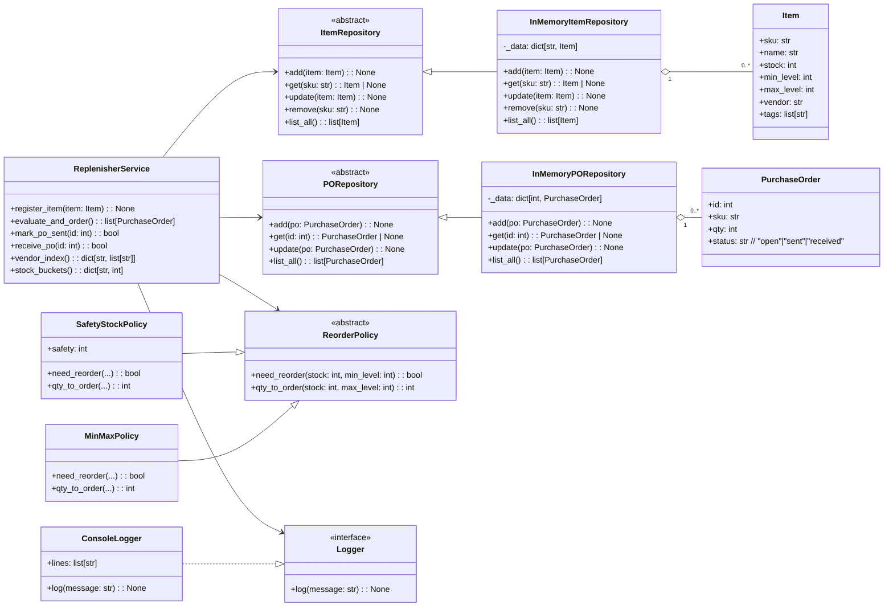

# Reabastecedor de Almacé

El **Reabastecedor de Almacén** es una aplicación para evaluar conceptos de **POO** en Python gestionando ítems de inventario, detectando cuándo reordenar, generando órdenes de compra y actualizando stock al recibirlas.

El modelo de la aplicación es el siguiente:

---

## 1. Completa la clase `Item`

Representa un ítem en inventario.

### Requisitos:

* Implementar como `dataclass`.
* Atributos:

  * `sku: str`
  * `name: str`
  * `stock: int`
  * `min_level: int`
  * `max_level: int`
  * `vendor: str`
  * `tags: list[str]` (lista vacía por defecto)
* Al crear:

  * `sku`, `name`, `vendor` deben ser no vacíos tras `strip()`.
  * `stock >= 0`.
  * `0 < min_level <= max_level`.
  * Normalizar `tags`: recortar espacios, pasar a minúsculas, eliminar vacíos y duplicados preservando el orden.

---

## 2. Completa la clase `PurchaseOrder`

Representa una orden de compra (PO) a un proveedor.

### Requisitos:

* Implementar como `dataclass`.
* Constantes:

  * `OPEN: str = "open"`
  * `SENT: str = "sent"`
  * `RECEIVED: str = "received"`
* Atributos:

  * `id: int`
  * `sku: str`
  * `qty: int`
  * `status: str = PurchaseOrder.OPEN`
* Al crear:

  * `qty > 0`.
  * `status` debe ser una de las constantes definidas.

---

## 3. Completa los repositorios

Se requieren dos repositorios.

### 3.1 `ItemRepository` (ABC)

* Métodos abstractos:

  * `add(item: Item) -> None` (falla si `sku` duplicado)
  * `get(sku: str) -> Item | None`
  * `update(item: Item) -> None` (falla si `sku` no existe)
  * `remove(sku: str) -> None` (falla si `sku` no existe)
  * `list_all() -> list[Item]`

### 3.2 `InMemoryItemRepository`

* Implementa `ItemRepository`.
* Usa almacenamiento interno `dict[str, Item]`.

### 3.3 `PORepository` (ABC)

* Métodos abstractos:

  * `add(po: PurchaseOrder) -> None` (falla si `id` duplicado)
  * `get(po_id: int) -> PurchaseOrder | None`
  * `update(po: PurchaseOrder) -> None` (falla si no existe)
  * `list_all() -> list[PurchaseOrder]`

### 3.4 `InMemoryPORepository`

* Implementa `PORepository`.
* Usa `dict[int, PurchaseOrder]`.

---

## 4. Completa la política y el logger

### 4.1 `ReorderPolicy` (ABC)

* Métodos:

  * `need_reorder(stock: int, min_level: int) -> bool`
  * `qty_to_order(stock: int, max_level: int) -> int`

### 4.2 Implementa dos políticas

* `MinMaxPolicy`: reordenar si `stock <= min_level`; ordenar `max_level - stock`.
* `SafetyStockPolicy(safety: int)`: reordenar si `stock < safety`; ordenar `max(stock, safety) - stock + safety`.

### 4.3 `Logger` (Protocol)

* Método:

  * `log(message: str) -> None`
* `ConsoleLogger` debe implementar `Logger` y acumular `lines: list[str]`.

---

## 5. Completa la clase `ReplenisherService`

Orquesta reabastecimientos usando DI y contratos.

### Requisitos:

* El constructor recibe: `item_repo: ItemRepository`, `po_repo: PORepository`, `policy: ReorderPolicy`, `logger: Logger`.
* Métodos:

  * `register_item(item: Item) -> None`
    Agrega el ítem; registra `log("item <sku> registered")`.
  * `evaluate_and_order() -> list[PurchaseOrder]`
    Para cada ítem, si `policy.need_reorder(...)` es `True`, **crear** una `PurchaseOrder` con `qty = policy.qty_to_order(...)`, **almacenarla** y **retornar** la lista total de nuevas POs.
  * `mark_po_sent(po_id: int) -> bool`
    Cambiar estado de `"open"` a `"sent"`. Retorna `True` si se cambia; `False` si no existe o transición inválida.
  * `receive_po(po_id: int) -> bool`
    Cambiar estado de `"sent"` a `"received"`. Si se logra, **incrementar** el `stock` del `Item` asociado en `po.qty`. Retorna `True/False`.
  * `vendor_index() -> dict[str, list[str]]`
    Construir `proveedor -> lista de SKUs` (sin duplicados).
  * `stock_buckets() -> dict[str, int]`
    Retornar conteos por cubetas `{"zero","low","ok"}` definidas como: `zero` si `stock==0`; `low` si `0<stock<=min_level`; en otro caso `ok`.

> **Sugerencia:** usa comprehensions en índices/métricas; valida transiciones de estado estrictamente.

---
